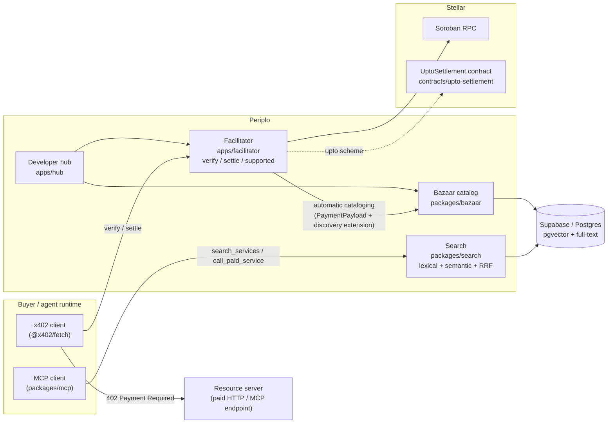

# Periplo

[](https://github.com/Eras256/Periplo/actions/workflows/ci.yml)

The discovery layer for x402-payable services on Stellar.

**Status: Phase 4 (automatic cataloging) complete, live on `stellar:testnet`
at https://periplo-testnet.fly.dev** (deployed early; the rest of Phase
10 is not done — see [`docs/DEFERRED.md`](docs/DEFERRED.md)). This README
states only what is built, linked, tested, or hashed today. Everything
else is roadmap, marked as such.

**No frontend yet.** The developer hub (`apps/hub`) is Phase 9 — not
started. `/browse`, `/playground`, `/status` and the rest of §10's routes
don't exist. The only user-facing surface right now is the facilitator's
JSON API itself.

## What's real right now

- Monorepo tooling: pnpm workspaces, TypeScript 7 (strict, `noUncheckedIndexedAccess`,
  `exactOptionalPropertyTypes`), Vitest, Biome, GitHub Actions CI.
- [`packages/licence-check`](packages/licence-check) — the CI gate that fails
  the build on any AGPL/copyleft transitive dependency (constraint: spec §1).
  Unit-tested, including the exact AGPL-3.0-or-later case named in the spec
  (the OpenZeppelin Relayer license).
- [`packages/bazaar`](packages/bazaar) — the catalog trust boundary:
  `checkRouteTemplate` (percent-decode fully, *then* reject path traversal,
  absolute URLs, protocol-relative paths, backslash traversal, null bytes,
  and malformed/overlong encoding — decode-before-check is what stops
  `%2e%2e` and `/%2f%2fevil.example`-style bypasses of a naive check) and
  `softDropFields` (a listing keeps every metadata field that validates,
  drops only the ones that don't — never rejected wholesale over one bad
  field). 45 unit tests exercise `checkRouteTemplate` alone (gate requires
  ≥20) — 101 tests total across the whole repo as of Phase 3.
- [`conformance/baseline/`](conformance/baseline) — real, captured HTTP
  transcripts against the public `x402.org` reference facilitator: its
  `/supported` response for `stellar:testnet` (confirming
  `extra.areFeesSponsored: true`), and confirmation that it has no discovery
  (Bazaar) endpoints today — the gap this project fills.
- [`supabase/migrations`](supabase/migrations) — the live catalog schema on
  a real Supabase project: the `resources` table, its full-text (`gin`) and
  vector (`hnsw`) retrieval indexes, and row-level security (public read;
  writes only via the service role — verified with automated tests that
  run for real against the project, not mocked). See
  [`packages/bazaar/src/db`](packages/bazaar/src/db) for the typed client.
- [`apps/facilitator`](apps/facilitator) — `verify`/`settle`/`supported`
  for the `exact` scheme, built on `@x402/core` + `@x402/stellar`
  (settlement logic is theirs, not reimplemented). A **real settled
  transaction on `stellar:testnet`** is recorded in
  [`conformance/RESULTS.md`](conformance/RESULTS.md), with the hash
  independently checked against Horizon — not just printed by our own
  script and trusted. Importable as a library (no HTTP required) for
  self-facilitation inside a resource server, or wrapped in the included
  Hono app for hosted/self-hosted use. **Live at
  https://periplo-testnet.fly.dev** — try `GET /`, `GET /health`, or
  `GET /supported` directly. `stellar:pubnet` is not configured (no
  mainnet key exists yet, deliberately). See
  [Deployment](#deployment-what-actually-runs) below for how it's run.
- **Automatic cataloging** (`apps/facilitator/src/discovery.ts`): a
  payment carrying the `bazaar` discovery extension is validated and
  written to the catalog on `/verify` and `/settle` — no separate
  registration step, no dashboard, no API key. Built on the official
  [`@x402/extensions/bazaar`](https://github.com/x402-foundation/x402/tree/main/typescript/packages/extensions/src/bazaar)
  package (same reasoning as not reimplementing verify/settle), with
  `packages/bazaar`'s own stricter `routeTemplate` check kept in place of
  the upstream equivalent — see [`docs/INTEROP.md`](docs/INTEROP.md) for
  exactly where and why, including a real upstream bug (`mcp://` URLs)
  found via the live integration test, not by inspection, and filed as
  [x402-foundation/x402#3121](https://github.com/x402-foundation/x402/issues/3121).
  Reports the
  outcome via the `EXTENSION-RESPONSES` header —
  `{"bazaar":{"status":"success"}}` or `{"status":"rejected","rejectedReason":"…"}`
  — verified end to end against the real Supabase project (catalog row
  appears for a valid HTTP or MCP listing; a crafted hostile
  `routeTemplate` produces no row and a specific rejection reason).
  [`docs/SELLERS.md`](docs/SELLERS.md) is the seller-facing how-to,
  including per-parameter descriptions (what Phase 5's search ranking
  will read).

Nothing else — no search ranking, no contract, no hub —
exists in this repository yet. Do not infer capability
from the rest of this document; the rest of this document is architecture,
not status.

## What Periplo is (planned)

An x402 facilitator for Stellar (`verify` / `settle` / `supported`, both
`stellar:testnet` and `stellar:pubnet`) built on `@x402/stellar`, paired with
a **Bazaar**: an automatically-populated catalog of x402-payable HTTP and MCP
services, with hybrid lexical + semantic search, so an agent can find and pay
for a service without a human wiring up an integration first. It also carries
`upto` — a metered payment scheme for Stellar that a plain SEP-41 allowance
cannot express — the network spec is open upstream as a Draft PR at
[x402-foundation/x402#3098](https://github.com/x402-foundation/x402/pull/3098)
([issue #3097](https://github.com/x402-foundation/x402/issues/3097)), with
three on-chain assumptions marked open. The Soroban contract is Phase 6, not
started.

This is a response to the Stellar Community Fund RFP *"X402 Facilitator with
Bazaar (discovery) support"* (SCF #45, Q3 2026). Full scope: see
[`docs/SPEC.md`](docs/SPEC.md), the build specification this repository is
being built against.

## Architecture

The **Facilitator** is real and deployed, and the automatic-cataloging edge
into **Bazaar** (the catalog itself — Supabase, not the node's full future
scope) is real too (see "What's real right now" above and
[Deployment](#deployment-what-actually-runs)). Search, the Hub, and the
`upto` contract are planned — this diagram is the target shape, not a
status report.



## Verify it yourself

```bash
pnpm install
pnpm typecheck
pnpm lint
pnpm test
pnpm licence-check
```

Baseline transcripts backing the conformance claims above:
[`conformance/baseline/x402-org/supported.md`](conformance/baseline/x402-org/supported.md),
[`conformance/baseline/x402-org/discovery-404.md`](conformance/baseline/x402-org/discovery-404.md),
[`conformance/baseline/x402-org/verify-settle-malformed.md`](conformance/baseline/x402-org/verify-settle-malformed.md).
Settled transaction evidence: [`conformance/RESULTS.md`](conformance/RESULTS.md).

CI (`.github/workflows/ci.yml`, badge above) runs the same gate on every
push — confirmed green via an [organic push-triggered
run](https://github.com/Eras256/Periplo/actions/runs/31222406798), not a
manual rerun. It was silently broken from Phase 1 to Phase 3 for two
independently verified causes; full timeline and raw evidence in
[`docs/DEFERRED.md`](docs/DEFERRED.md).

## Deployment (what actually runs)

`apps/facilitator` is live on Fly.io, `stellar:testnet` only:
**https://periplo-testnet.fly.dev** — 1 machine (`shared-cpu-1x`, 512MB,
region `iad`), auto-stops when idle and auto-starts on request
(`auto_stop_machines`/`auto_start_machines` in
[`fly.facilitator.toml`](fly.facilitator.toml)). No `periplo-mainnet` app
exists — there's no mainnet fee-sponsor key to back it, deliberately.

```bash
fly deploy --config fly.facilitator.toml --dockerfile Dockerfile.facilitator -a periplo-testnet
```

Run from the repo root (the Docker build context has to include the pnpm
workspace root, even though the image only ships `apps/facilitator`).
Secrets (`STELLAR_FEE_SPONSOR_SECRET`, `STELLAR_NETWORK`) are set via
`fly secrets set -a periplo-testnet`, never committed or put in
`fly.facilitator.toml`.

## Licence

Apache-2.0 — see [`LICENSE`](LICENSE). No AGPL or other copyleft dependency
is permitted anywhere in the dependency path; enforced in CI by
`packages/licence-check`.

## Dependency versions

Pinned versions and their live-registry verification dates are tracked in the
build spec's manifest and re-checked incrementally per phase; see
[`docs/DEFERRED.md`](docs/DEFERRED.md) for the current verification status.
A full re-verification pass with dates stated here is required before
submission (spec §11) — not yet done, since most pinned packages aren't
introduced into the codebase yet.

## Documentation

- [`docs/SPEC.md`](docs/SPEC.md) — the full build specification, phased 0–10.
- [`CLAUDE.md`](CLAUDE.md) — repo guide for Claude Code sessions (commands,
  architecture, working rules).
- [`docs/SKILLS.md`](docs/SKILLS.md) — which `stellar-build` skills are
  actually available in the build environment, mapped to spec phases.
- [`docs/DEFERRED.md`](docs/DEFERRED.md) — everything deliberately not built
  yet, and every environment divergence from the spec's assumptions.
- [`docs/MEMORY.md`](docs/MEMORY.md) — running log of *why* things were
  built the way they were.
- [`docs/ECOSYSTEM.md`](docs/ECOSYSTEM.md) — partial, dated snapshot of the
  competitive landscape (regenerate before relying on it).
- [`docs/SELLERS.md`](docs/SELLERS.md) — how a resource server lists a
  Stellar service on the Bazaar (Phase 4).
- [`docs/INTEROP.md`](docs/INTEROP.md) — where Periplo's bazaar extension
  handling diverges from the canonical `@x402/extensions/bazaar`
  implementation, and why (Phase 4).
