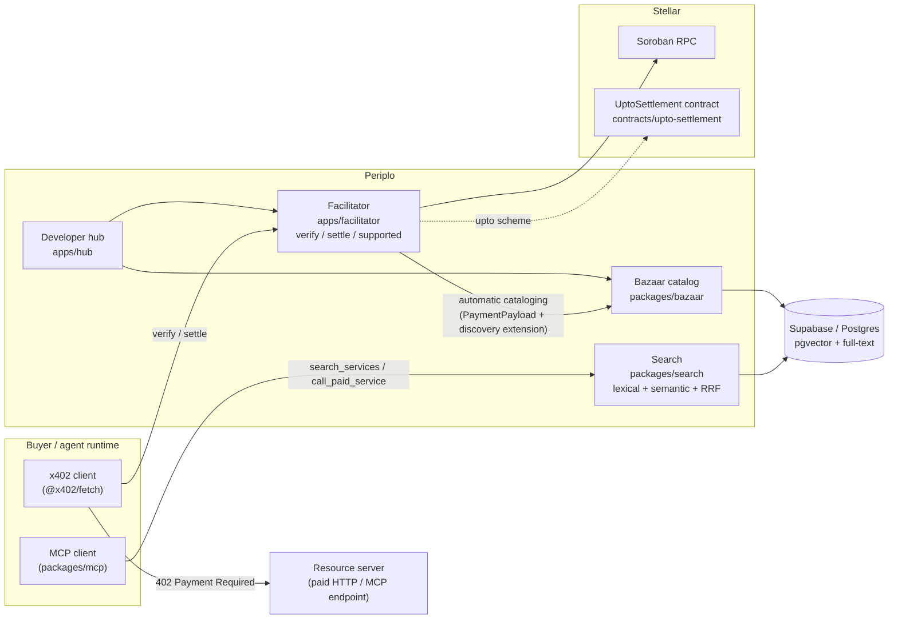

# Periplo

The discovery layer for x402-payable services on Stellar.

**Status: Phase 2 (data layer) complete.** This README states
only what is built, linked, tested, or hashed today. Everything else is
roadmap, marked as such. See [`docs/DEFERRED.md`](docs/DEFERRED.md) for
what's deliberately not built yet and why.

## What's real right now

- Monorepo tooling: pnpm workspaces, TypeScript 7 (strict, `noUncheckedIndexedAccess`,
  `exactOptionalPropertyTypes`), Vitest, Biome, GitHub Actions CI.
- [`packages/licence-check`](packages/licence-check) — the CI gate that fails
  the build on any AGPL/copyleft transitive dependency (constraint: spec §1).
  Unit-tested, including the exact AGPL-3.0-or-later case named in the spec
  (the OpenZeppelin Relayer license).
- [`packages/bazaar`](packages/bazaar) — the catalog trust boundary:
  `checkRouteTemplate` (percent-decode fully, *then* reject path traversal,
  absolute URLs, protocol-relative paths, backslash traversal, null bytes,
  and malformed/overlong encoding — decode-before-check is what stops
  `%2e%2e` and `/%2f%2fevil.example`-style bypasses of a naive check) and
  `softDropFields` (a listing keeps every metadata field that validates,
  drops only the ones that don't — never rejected wholesale over one bad
  field). 70 unit tests across the repo, 45 of them exercising
  `checkRouteTemplate` alone (gate requires ≥20).
- [`conformance/baseline/`](conformance/baseline) — real, captured HTTP
  transcripts against the public `x402.org` reference facilitator: its
  `/supported` response for `stellar:testnet` (confirming
  `extra.areFeesSponsored: true`), and confirmation that it has no discovery
  (Bazaar) endpoints today — the gap this project fills.
- [`supabase/migrations`](supabase/migrations) — the live catalog schema on
  a real Supabase project: the `resources` table, its full-text (`gin`) and
  vector (`hnsw`) retrieval indexes, and row-level security (public read;
  writes only via the service role — verified with automated tests that
  run for real against the project, not mocked). See
  [`packages/bazaar/src/db`](packages/bazaar/src/db) for the typed client.

Nothing else — no facilitator, no search ranking, no contract, no hub —
exists in this repository yet. Do not infer capability
from the rest of this document; the rest of this document is architecture,
not status.

## What Periplo is (planned)

An x402 facilitator for Stellar (`verify` / `settle` / `supported`, both
`stellar:testnet` and `stellar:pubnet`) built on `@x402/stellar`, paired with
a **Bazaar**: an automatically-populated catalog of x402-payable HTTP and MCP
services, with hybrid lexical + semantic search, so an agent can find and pay
for a service without a human wiring up an integration first. It also carries
`upto` — a metered payment scheme for Stellar that a plain SEP-41 allowance
cannot express (see [`spec/`](spec/), Phase 6, not yet written).

This is a response to the Stellar Community Fund RFP *"X402 Facilitator with
Bazaar (discovery) support"* (SCF #45, Q3 2026). Full scope: see
[`docs/SPEC.md`](docs/SPEC.md), the build specification this repository is
being built against.

## Architecture (planned — nothing below this line is deployed yet)



## Verify it yourself

```bash
pnpm install
pnpm typecheck
pnpm lint
pnpm test
pnpm licence-check
```

Baseline transcripts backing the conformance claims above:
[`conformance/baseline/x402-org/supported.md`](conformance/baseline/x402-org/supported.md),
[`conformance/baseline/x402-org/discovery-404.md`](conformance/baseline/x402-org/discovery-404.md).

## Licence

Apache-2.0 — see [`LICENSE`](LICENSE). No AGPL or other copyleft dependency
is permitted anywhere in the dependency path; enforced in CI by
`packages/licence-check` (see [`docs/DEFERRED.md`](docs/DEFERRED.md) for the
one job — `osv-scan` — still pending its first live CI run).

## Dependency versions

Pinned versions and their live-registry verification dates are tracked in the
build spec's manifest and re-checked incrementally per phase; see
[`docs/DEFERRED.md`](docs/DEFERRED.md) for the current verification status.
A full re-verification pass with dates stated here is required before
submission (spec §11) — not yet done, since most pinned packages aren't
introduced into the codebase yet.

## Documentation

- [`docs/SPEC.md`](docs/SPEC.md) — the full build specification, phased 0–10.
- [`CLAUDE.md`](CLAUDE.md) — repo guide for Claude Code sessions (commands,
  architecture, working rules).
- [`docs/SKILLS.md`](docs/SKILLS.md) — which `stellar-build` skills are
  actually available in the build environment, mapped to spec phases.
- [`docs/DEFERRED.md`](docs/DEFERRED.md) — everything deliberately not built
  yet, and every environment divergence from the spec's assumptions.
- [`docs/MEMORY.md`](docs/MEMORY.md) — running log of *why* things were
  built the way they were.
- [`docs/ECOSYSTEM.md`](docs/ECOSYSTEM.md) — partial, dated snapshot of the
  competitive landscape (regenerate before relying on it for the submission).
