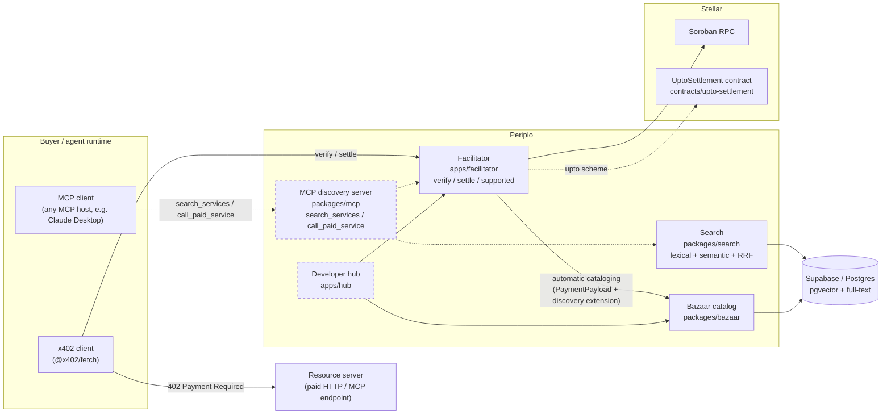

# Periplo

[](https://github.com/Eras256/Periplo/actions/workflows/ci.yml)

The discovery layer for x402-payable services on Stellar.

**Status: Phase 6, the `upto` Soroban contract, is complete.** The
facilitator is live on `stellar:testnet` at
https://periplo-testnet.fly.dev. The rest of Phase 10 is not done; see
[`docs/DEFERRED.md`](docs/DEFERRED.md). This README states what is built,
linked, tested, or hashed today. Everything else is marked as planned.

**There is no frontend yet.** The developer hub (`apps/hub`) is Phase 9
and has not started. `/browse`, `/playground`, `/status` and the rest of
§10's routes do not exist. The facilitator's JSON API is the only
user-facing surface right now.

## What's real right now

- Monorepo tooling: pnpm workspaces, TypeScript 7 (strict,
  `noUncheckedIndexedAccess`, `exactOptionalPropertyTypes`), Vitest,
  Biome, GitHub Actions CI.
- [`packages/licence-check`](packages/licence-check) is the CI gate. It
  fails the build on any AGPL or copyleft transitive dependency
  (constraint: spec §1). It is unit-tested, including the exact
  AGPL-3.0-or-later case the spec names: the OpenZeppelin Relayer
  license.
- [`packages/bazaar`](packages/bazaar) is the catalog trust boundary.
  `checkRouteTemplate` decodes a route template fully, then rejects path
  traversal, absolute URLs, protocol-relative paths, backslash traversal,
  null bytes, and malformed or overlong encoding. Decoding before
  checking is what stops bypasses like `%2e%2e` and
  `/%2f%2fevil.example` against a naive check. `softDropFields` keeps
  every metadata field that validates and drops only the ones that fail,
  so one bad field never rejects the whole listing. 45 unit tests
  exercise `checkRouteTemplate` alone; the gate requires ≥20. The whole
  repo has 156 tests as of Phase 5, including the live-Supabase
  integration suites, counted with a fresh `pnpm run ci` run.
- [`conformance/baseline/`](conformance/baseline) holds real, captured
  HTTP transcripts against the public `x402.org` reference facilitator:
  its `/supported` response for `stellar:testnet`, confirming
  `extra.areFeesSponsored: true`, and confirmation that it has no
  discovery (Bazaar) endpoints today. That gap is what this project
  fills.
- [`supabase/migrations`](supabase/migrations) holds the live catalog
  schema on a real Supabase project: the `resources` table, its
  full-text (`gin`) and vector (`hnsw`) retrieval indexes, and
  row-level security. Reads are public. Writes go through the service
  role only, verified with automated tests that run against the real
  project. See [`packages/bazaar/src/db`](packages/bazaar/src/db) for
  the typed client.
- [`apps/facilitator`](apps/facilitator) implements `verify`, `settle`,
  and `supported` for the `exact` scheme, built on `@x402/core` and
  `@x402/stellar`. Settlement logic comes from those packages. A **real
  settled transaction on `stellar:testnet`** is recorded in
  [`conformance/RESULTS.md`](conformance/RESULTS.md), with the hash
  checked independently against Horizon. It is importable as a library,
  with no HTTP hop required, for self-facilitation inside a resource
  server. It also ships as a Hono app for hosted or self-hosted use. **It
  is live at https://periplo-testnet.fly.dev**: try `GET /`,
  `GET /health`, or `GET /supported` directly. `stellar:pubnet` is not
  configured because no mainnet key exists yet. See
  [Deployment](#deployment-what-actually-runs) below for how it runs.
- **Automatic cataloging** lives in `apps/facilitator/src/discovery.ts`.
  A payment carrying the `bazaar` discovery extension is validated and
  written to the catalog on `/verify` and `/settle`. There is no
  separate registration step, no dashboard, and no API key.

  It is built on the official
  [`@x402/extensions/bazaar`](https://github.com/x402-foundation/x402/tree/main/typescript/packages/extensions/src/bazaar)
  package, for the same reason the facilitator does not reimplement
  verify and settle. We kept `packages/bazaar`'s own stricter
  `routeTemplate` check in place of the upstream equivalent;
  [`docs/INTEROP.md`](docs/INTEROP.md) explains where and why. That work
  also surfaced a real bug in the upstream package itself, affecting
  `mcp://tool/{toolName}` URLs, the exact convention the Bazaar extension
  documents for MCP tools. We found it through the live integration
  test, not by reading the code, and filed it as
  [x402-foundation/x402#3121](https://github.com/x402-foundation/x402/issues/3121).
  A fix is now open against it as
  [x402-foundation/x402#3138](https://github.com/x402-foundation/x402/pull/3138),
  built scheme-agnostic per a reviewer's suggested shape rather than an
  `mcp://`-specific patch.

  The facilitator reports the outcome through the `EXTENSION-RESPONSES`
  header: `{"bazaar":{"status":"success"}}`, or
  `{"status":"rejected","rejectedReason":"routeTemplate failed validation"}`.
  We verified this end to end against the real Supabase project: a
  catalog row appears for a valid HTTP or MCP listing, and a crafted
  hostile `routeTemplate` produces no row and a specific rejection
  reason. [`docs/SELLERS.md`](docs/SELLERS.md) is the seller-facing
  how-to, including per-parameter descriptions, which search ranking now
  reads.
- [`packages/search`](packages/search) is hybrid retrieval: Postgres
  `tsvector`/GIN for lexical matching, pgvector/HNSW for semantic
  matching, fused with Reciprocal Rank Fusion. Embeddings come from
  `fastembed`'s `BGESmallENV15` model, running locally with no API key
  and no per-call cost. Every payment that catalogs a resource embeds it
  automatically, in the same write path Phase 4 already uses.
  [`eval/`](eval) is the honest measurement the spec asks for: 55 fixed
  resources, including deliberate near-duplicate clusters (`geocode` vs.
  `reverse-geocode`, `weather` vs. `weather-forecast` vs. `air-quality`,
  and more), and 300 graded queries, run with `pnpm eval` against the real
  Supabase project. Current numbers: **nDCG@10 0.9346, MRR 0.9226**,
  checked into [`eval/baseline.json`](eval/baseline.json), with CI failing
  the build if nDCG@10 regresses more than 5%. An earlier, smaller set (20
  resources, 40 queries, all in unrelated domains) scored 0.99, which
  turned out to be an overfitting signal rather than evidence of good
  ranking; the harder set above replaced it. The eval set is planned to
  grow further, toward 500 graded queries, and the search endpoint has
  not yet been hardened for production load.
- [`contracts/upto-settlement`](contracts/upto-settlement) is
  `UptoSettlement`, the Soroban contract behind `upto`'s `contract`
  profile: `require_auth_for_args` restricted to `(authorization,)` keeps
  the settled amount outside what the buyer signs, an atomic
  pull-pay-refund moves funds with no custody window, and a nonce in
  temporary storage enforces single use. 27 unit and property tests, plus
  a `cargo-fuzz` target that ran 47,630 executions against the
  ceiling/time-bound arithmetic with zero crashes. Deployed to
  `stellar:testnet`
  (`CAK3R734WLT4JU2XMQOJ6NIB3BWGPI442CH44EFJG5AORMXFE7G4MQFW`); a real
  **partial settlement** (buyer signs a ceiling, facilitator settles less)
  is recorded in [`conformance/RESULTS.md`](conformance/RESULTS.md),
  independently checked against Horizon, closing all three on-chain
  assumptions the spec PR marks open.

## What Periplo is (planned)

The target is an x402 facilitator for Stellar: `verify`, `settle`, and
`supported`, for both `stellar:testnet` and `stellar:pubnet`, built on
`@x402/stellar`. It pairs with a **Bazaar**: an automatically-populated
catalog of x402-payable HTTP and MCP services, so an agent can find and
pay for a service without a human wiring up an integration first.

It also carries `upto`, a metered payment scheme for Stellar that a
plain SEP-41 allowance cannot express: it fails recipient binding
(`transfer_from` lets the spender choose any destination) and single-use
(an allowance is a standing balance). The network spec is open upstream at
[x402-foundation/x402#3098](https://github.com/x402-foundation/x402/pull/3098)
([issue #3097](https://github.com/x402-foundation/x402/issues/3097)), marked
ready for review. It documents two conformant profiles: `contract`, this
project's design, described below, and `stateless`, an alternative
contributed by [Iam0TI](https://github.com/Iam0TI) via
[0d1026/Rialto](https://github.com/0d1026/Rialto) and
[x402-foundation/x402#3134](https://github.com/x402-foundation/x402/pull/3134),
credited and merged into the same spec rather than left as a second,
competing PR. The Soroban contract, `contracts/upto-settlement`, is
built, tested, and deployed to `stellar:testnet`
(`CAK3R734WLT4JU2XMQOJ6NIB3BWGPI442CH44EFJG5AORMXFE7G4MQFW`), with a real
settled transaction recorded in
[`conformance/RESULTS.md`](conformance/RESULTS.md) closing all three
on-chain assumptions the spec PR marks open.

This is a response to the Stellar Community Fund RFP, "X402 Facilitator
with Bazaar (discovery) support" (SCF #45, Q3 2026). See
[`docs/SPEC.md`](docs/SPEC.md) for full scope: the build specification
this repository is built against.

## Architecture

The **Facilitator**, the automatic-cataloging edge into **Bazaar**,
**Search**, and the **`UptoSettlement`** contract are all real and
deployed. Bazaar here means the catalog itself, backed by Supabase, not
the node's full future scope. See "What's real right now" above and
[Deployment](#deployment-what-actually-runs). The Hub is still planned,
and the facilitator does not call `UptoSettlement` yet: the contract
itself is deployed and settled a real transaction
(`conformance/RESULTS.md`), but wiring `upto` into `/verify`/`/settle`'s
HTTP routes (the TypeScript client/facilitator package mirroring
`@x402/stellar`'s `exact` implementation) is separate, not-yet-started
work, tracked in `docs/DEFERRED.md`. Solid borders below mark what runs
today; dashed borders and edges mark what does not.



## Verify it yourself

```bash
pnpm install
pnpm typecheck
pnpm lint
pnpm test
pnpm licence-check
```

Baseline transcripts backing the conformance claims above:
[`conformance/baseline/x402-org/supported.md`](conformance/baseline/x402-org/supported.md),
[`conformance/baseline/x402-org/discovery-404.md`](conformance/baseline/x402-org/discovery-404.md),
[`conformance/baseline/x402-org/verify-settle-malformed.md`](conformance/baseline/x402-org/verify-settle-malformed.md).
Settled transaction evidence: [`conformance/RESULTS.md`](conformance/RESULTS.md).

CI (`.github/workflows/ci.yml`, badge above) runs the same gate on every
push. We confirmed it green with an
[organic push-triggered run](https://github.com/Eras256/Periplo/actions/runs/31222406798)
rather than a manual rerun. It was silently broken from Phase 1 to Phase
3 for two independently verified causes. Full timeline and raw evidence
are in [`docs/DEFERRED.md`](docs/DEFERRED.md).

## Deployment (what actually runs)

`apps/facilitator` is live on Fly.io, `stellar:testnet` only, at
**https://periplo-testnet.fly.dev**. It runs on 1 machine
(`shared-cpu-1x`, 512MB, region `iad`). The machine auto-stops when idle
and auto-starts on request, configured by `auto_stop_machines` and
`auto_start_machines` in
[`fly.facilitator.toml`](fly.facilitator.toml). No `periplo-mainnet` app
exists yet: there is no mainnet fee-sponsor key to back one.

```bash
fly deploy --config fly.facilitator.toml --dockerfile Dockerfile.facilitator -a periplo-testnet
```

Run this from the repo root. The Docker build context needs the pnpm
workspace root, even though the image only ships `apps/facilitator`.
Secrets (`STELLAR_FEE_SPONSOR_SECRET`, `STELLAR_NETWORK`) are set with
`fly secrets set -a periplo-testnet`. They are never committed or
placed in `fly.facilitator.toml`.

## Licence

Apache-2.0. See [`LICENSE`](LICENSE). No AGPL or other copyleft
dependency is permitted anywhere in the dependency path. This is
enforced in CI by `packages/licence-check`.

## Dependency versions

Pinned versions and their live-registry verification dates are tracked
in the build spec's manifest and re-checked incrementally per phase. See
[`docs/DEFERRED.md`](docs/DEFERRED.md) for the current verification
status. A full re-verification pass, with dates stated here, is required
before submission under spec §11. That pass has not happened yet, since
most pinned packages are not yet introduced into the codebase.

## Documentation

- [`docs/SPEC.md`](docs/SPEC.md): the full build specification, phased
  0 to 10.
- [`CLAUDE.md`](CLAUDE.md): repo guide for Claude Code sessions
  (commands, architecture, working rules).
- [`docs/SKILLS.md`](docs/SKILLS.md): which `stellar-build` skills are
  actually available in the build environment, mapped to spec phases.
- [`docs/DEFERRED.md`](docs/DEFERRED.md): everything deliberately not
  built yet, and every environment divergence from the spec's
  assumptions.
- [`docs/MEMORY.md`](docs/MEMORY.md): running log of why things were
  built the way they were.
- [`docs/ECOSYSTEM.md`](docs/ECOSYSTEM.md): a partial, dated snapshot of
  the competitive landscape. Regenerate it before relying on it.
- [`docs/SELLERS.md`](docs/SELLERS.md): how a resource server lists a
  Stellar service on the Bazaar (Phase 4).
- [`docs/INTEROP.md`](docs/INTEROP.md): where Periplo's bazaar extension
  handling diverges from the canonical `@x402/extensions/bazaar`
  implementation, and why (Phase 4).
