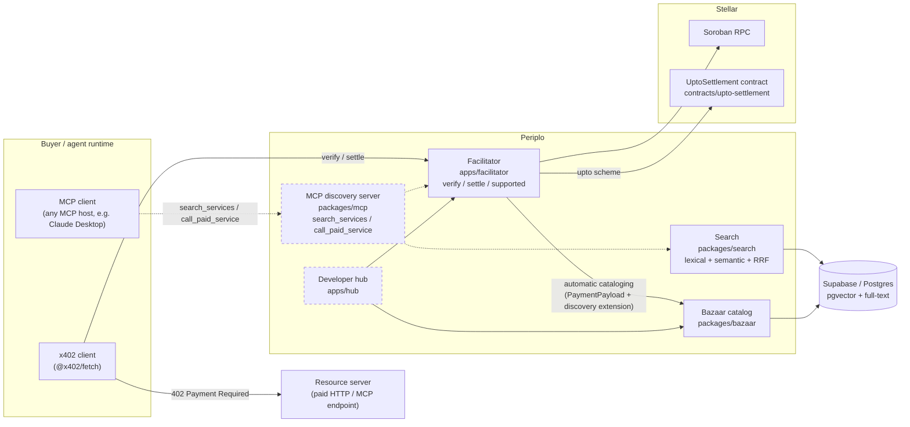

# Architecture

`docs/SPEC.md` §11: the diagram plus a plain-English explanation of the
stack, both required by the submission form. Solid borders and edges
below mark what runs today; dashed borders and edges mark what's still
planned. See [`README.md`](../README.md#whats-real-right-now) for the
evidence behind every "real" claim (links, tests, hashes), this file is
the shape of the system, not the proof.

## What runs today, real and deployed

- **Facilitator** (`apps/facilitator`): `verify`/`settle`/`supported` for
  the `exact` scheme on Stellar, built on `@x402/core` and
  `@x402/stellar`, not reimplemented. Live at
  `https://periplo-testnet.fly.dev`. Importable as a library for
  self-facilitation (no HTTP hop, `docs/SELF-FACILITATION.md`), or ships
  as a Hono app for hosted/self-hosted use (`docs/SELLERS.md`,
  `docs/DECENTRALIZATION.md`).
- **Bazaar catalog** (`packages/bazaar`): the automatic-cataloging trust
  boundary. When a settled payment carries the official `bazaar`
  discovery extension, the facilitator validates it
  (`checkRouteTemplate`'s stricter, decode-then-validate check on top of
  `@x402/extensions/bazaar`'s own schema validation, `docs/INTEROP.md`)
  and writes a row, merging into `accepts` rather than duplicating on
  repeat payments.
- **Search** (`packages/search`): hybrid retrieval over the same
  Postgres catalog, lexical (`tsvector`/GIN) fused with semantic
  (local `fastembed` embeddings, HNSW) via Reciprocal Rank Fusion.
  Reachable at `GET /discovery/resources`/`GET /discovery/search`.
- **`UptoSettlement`** (`contracts/upto-settlement`): the Soroban
  contract behind the `upto` scheme's `contract` profile (a plain SEP-41
  allowance can't express recipient-bound, single-use metered payment).
  Deployed to `stellar:testnet`, a real settled transaction recorded in
  `conformance/RESULTS.md`. **Wired into the facilitator's own
  `/verify`/`/settle` HTTP routes in code** (`UptoStellarScheme`,
  `apps/facilitator/src/upto-stellar-scheme.ts`), with a real signed
  `upto` payment settled through those exact entry points and recorded
  in `conformance/RESULTS.md`. Not yet reflected on the live
  `https://periplo-testnet.fly.dev` deployment: that needs
  `UPTO_SETTLEMENT_CONTRACT_TESTNET` set and a redeploy, blocked on a
  `fly` account mismatch, tracked in `docs/DEFERRED.md`.
- **Supabase / Postgres**: the one real datastore, holding the catalog
  table both Bazaar and Search read from and write to. Public read (RLS),
  writes only via the service role.

## What's still planned (dashed in the diagram)

- **MCP discovery server** (`packages/mcp`): lets an MCP client (`search_services`/
  `call_paid_service`) discover and pay for a service through the same
  catalog and facilitator, no bespoke integration per agent host. Phase
  7, not started.
- **Developer hub** (`apps/hub`): the only planned human-facing surface.
  Everything real today is API-only, `GET /` on the facilitator returns a
  JSON description rather than a page. Phase 9, not started.

## Why this shape, not a monolith

Facilitator, catalog, and search are three separate concerns sharing one
datastore, not three copies of the same logic: the facilitator's only
write path into the catalog is "a payment settled, and it carried a
valid discovery extension", never a direct insert, so a listing can't
exist without a real payment behind it (spec's trust-boundary
requirement). Search reads the same table the facilitator writes,
nothing is denormalized or synced between separate stores. `docs/SELF-FACILITATION.md`
and `docs/SELLERS.md` are the two ends of the same idea from a seller's
side: run the facilitator yourself, or point at Periplo's, either way the
wire protocol and the catalog format are the same official, replicable
shapes (`docs/DECENTRALIZATION.md`).
